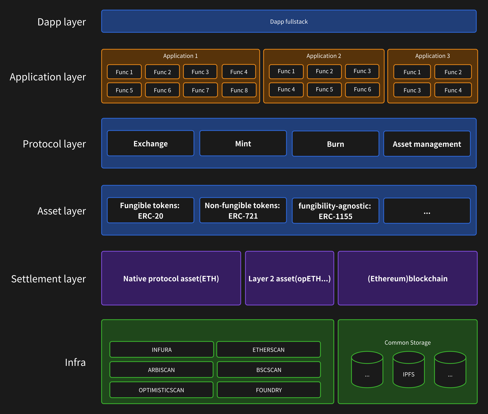

# **Efficient Token Swapping with Uniswap V3: A Foundry-Based Implementation**

This project utilizes [PaulRBerg's foundry-template](https://github.com/PaulRBerg/foundry-template), a Foundry-based
template for developing Solidity smart contracts with sensible defaults.

The provided documentation and code give an in-depth look into a Uniswap V3 swap operation using Foundry, a smart
contract development tool. Let's break down the essentials.

### Infrastructure Diagram



### Uniswap V3 Swap

The Uniswap V3 swap functionality is encapsulated within the `UniswapV3Swap` contract. This contract demonstrates two
primary methods of swapping tokens on the Uniswap V3 protocol: single-hop and multi-hop swaps. Uniswap V3 introduces
concentrated liquidity, allowing liquidity providers to allocate their funds to specific price ranges, thus making swaps
more capital efficient, especially in targeted price ranges.

### Single-hop Swap

The `swapExactInputSingleHop` function is designed for a direct swap between two tokens within a single liquidity pool.
It takes the addresses of the input and output tokens, the pool's fee tier, and the amount of the input token to swap.
The function then constructs a swap parameters struct, calls the Uniswap V3 router's `exactInputSingle` method, and
returns the amount of the output token received. This operation is typically more gas-efficient than multi-hop swaps
when a direct pool exists between the desired tokens.

### Multi-hop Swap

The `swapExactInputMultiHop` function facilitates a swap that can route through multiple pools to convert an input token
to an output token, potentially involving intermediary tokens. This is useful when no direct pool exists between the
input and output tokens or when a multi-hop route offers better pricing. The function accepts an encoded path of tokens
and pool fees, alongside the amount of the input token, to dynamically determine the swap route. It then calls the
Uniswap V3 router's `exactInput` method with these parameters.

### Testing with Foundry

The testing contract, `UniV3SwapTest`, uses Foundry's `PRBTest` for assertions and `StdCheats` for blockchain state
manipulation, such as forking mainnet. This setup allows testing the `UniswapV3Swap` contract under real-world
conditions by interacting with actual Uniswap V3 pools on the mainnet (via a forked environment).

- **Setup**: Initializes a fork of the Ethereum mainnet and deploys the `UniswapV3Swap` contract within this test
  environment.
- **Test Functions**: Two test functions correspond to the single-hop and multi-hop swap functionalities. Each test
  deposits ETH into WETH (a common practice for interacting with DeFi protocols), approves the `UniswapV3Swap` contract
  to spend the WETH, and performs the swap. The output tokens received (DAI in the single-hop test, DAI via USDC in the
  multi-hop test) are logged for verification.

### Essential Commands

Commands for setting up the Foundry environment, building and testing the smart contracts, deploying them to a testnet
or local development environment, and generating UML diagrams for better understanding the contract's structure and
storage layout.

**Getting Started**

1. Create a new directory:

   ```
   $ mkdir uniswap-v3-foundry
   $ cd uniswap-v3-foundry
   ```

2. Initialize the project with the foundry-template:

   ```
   $ forge init --template PaulRBerg/foundry-template
   ```

3. Install dependencies (Solhint, Prettier, and other Node.js dependencies):
   ```
   $ bun install
   ```

**Building and Testing**

- Build the contracts:

  ```
  $ forge build
  ```

- Delete the build artifacts and cache directories:

  ```
  $ forge clean
  ```

- Get a test coverage report:

  ```
  $ forge coverage
  ```

- Run the tests:

  ```
  $ forge test
  $ forge test --match-path test/UniswapV3Swap.t.sol
  ```

- Get a gas report:
  ```
  $ forge test --gas-report
  ```

**Deployment**

- Deploy to testnet:

  - Load the variables in the .env file:
    ```
    $ source .env
    ```
  - Deploy and verify the contract:
    ```
    $ forge script script/DeployUniV3Swap.s.sol --rpc-url sepolia --broadcast --verify -vvvv
    ```

- Deploy to Anvil:
  ```
  $ forge script script/Deploy.s.sol --broadcast --fork-url http://localhost:8545
  ```

### Additional Tools

**Cast Interface**

Another tool I utilized was Cast, a command-line utility part of the Foundry suite, designed for interacting with
Ethereum smart contracts, sending transactions, and retrieving blockchain data directly from the command line. In this
instance, I used Cast to obtain the interface of the Uniswap V3 Swap Router. The `cast interface` command generates a
Solidity interface for deployed contracts.

```bash
$ cast interface 0xE592427A0AEce92De3Edee1F18E0157C05861564
```

You provide it with the contract address or the path to an ABI file as an argument. If an address is specified, then the
ABI is fetched from Etherscan.

**Solidity 2 UML**

This project also utilizes the Solidity 2 UML tool available at
[https://github.com/naddison36/sol2uml](https://github.com/naddison36/sol2uml).

- To check the version of sol2uml:

  ```
  $ npm ls sol2uml -g
  ```

- To generate a class diagram:

  ```
  $ sol2uml class ./src/UniswapV3Swap.sol
  ```

- To generate a storage diagram:
  ```
  $ sol2uml storage -c UniswapV3Swap ./src/UniswapV3Swap.sol
  ```

### Final Notes

This comprehensive setup demonstrates not just the implementation of Uniswap V3 swaps but also an efficient development,
testing, and deployment workflow using Foundry. The use of real-world token addresses (WETH, DAI, USDC) and the ability
to test against the mainnet via forking provide a robust framework for developing and verifying DeFi smart contracts.
